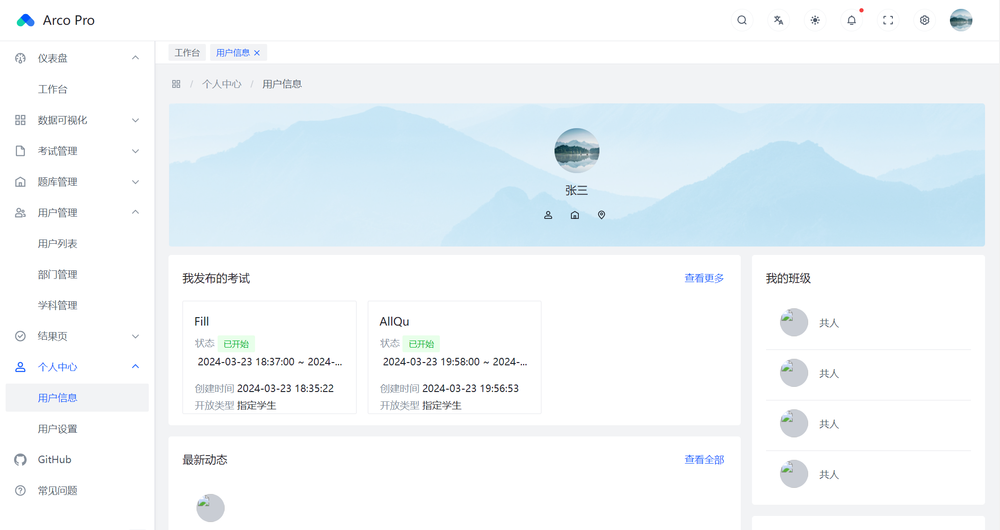
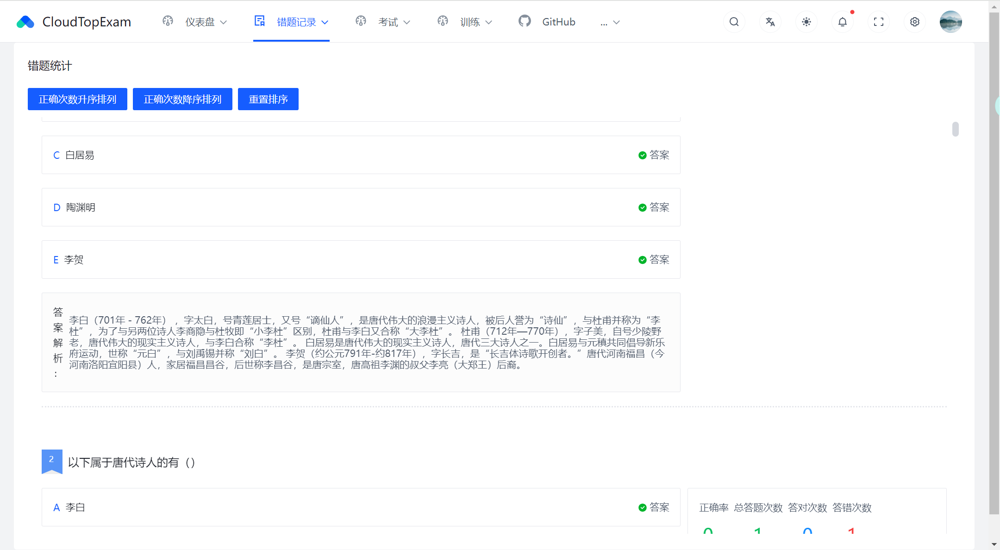

# 考试系统

获取数据库文件请查看[说明文档](https://jinglong233.github.io/CloudTopExamDoc/)

# 系统功能

## 管理/教师功能

| 功能     | 说明                               |
|--------|----------------------------------|
| 找回密码   | 支持QQ邮箱验证码找回（其余邮箱不支持）             |
| 工作台    | 查看系统的概览、考试数据、  公告、  待批阅试卷、人数占比等  |
| 分析页    | 错题最多的五个知识点的总错题数、错题总量、错题题型知识点分布   |
| 班级错题分析 | 获取对应班级的错题知识点TOP5、错题学科TOP5        |
| 试卷错题分析 | 该套试卷所有错题分析                       |
| 创建试卷   | 支持从题库随机抽取、指定选题创建试卷               |
| 创建考试   | 选定已创建的试卷进行试卷的创建                  |
| 批阅试卷   | 选定指定考试进行批阅                       |
| 题库管理   | 支持题库的增删改查                        |
| 添加题目   | 支持单选、多选、判断、填空、简答五种题型的添加          |
| 题目批量导出 | 支持题目的批量导入（但不能太多^V^）              |
| 用户管理   | 支持用户的增删改查                        |
| 部门管理   | 支持部门的增删改查、排序、查看对应部门下的所有用户        |
| 学科管理   | 支持学科的增删改查、排序                     |
| 用户信息   | 查看个人最近发布的考试、创建的试卷                |
| 用户设置   | 修改个人的手机、性别、登录密码、安全邮箱 （手机绑定功能待添加） |
| 发送消息   | 支持发送公告、站内消息、邮件消息（目前只只支持QQ邮箱）     |
| 日志管理   | 记录用户的登录、操作日志信息                   |

## 学生端功能

| 功能   | 说明                                                                                                                          |
|------|-----------------------------------------------------------------------------------------------------------------------------|
| 工作台  | 个人的错题知识点统计、未完成的训练（命名不正确，后续会改🙈） |
| 智能训练 | 根据当前错题统计分析，采用协同过滤、杰尔卡德算法进行错题推荐训练                                                                                            |
| 错题统计 | 统计考试、训练中所有错题，可进行正确率排序                                                                                                       |
| 考试   | 支持单选、多选、判断、填空、简答五种题型的作答                                                                                                     |
| 训练   | 支持多种形式的作答训练                                                                                                                 |
| 训练记录 | 查看所有训练过的记录、可对未完成训练进行继续训练                                                                                                    |
| 个人中心 | 支持基本信息的修改、手机绑定功能后续会添加 🙈）|

# 项目交流

CloudTopExam交流群1： **967055645**

# 仓库地址

- gitee: https://gitee.com/Jinglong233/cloud-top-exam
- github: https://github.com/Jinglong233/CloudTopExam

# 部分截图

